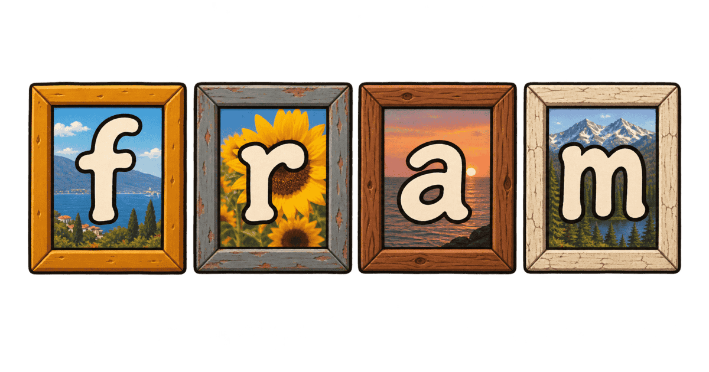

<div align="center">
  
</div>

<h1 align="center"><code>fram</code> /fɹeɪ̯m/</h1>

This is a small static photo and video gallery generator written in C17.

## LLM disclosure

> [!warning]
> I used LLMs extensively to create this project, mostly GPT-5.6 Sol.

## Installation

Download a prebuilt binary from the [Releases](https://github.com/unindented/fram-c17/releases) page, or [build from source](#contributing).

## Usage

`fram` is command-based:

- `fram build`: Generate the gallery in the configured output directory. Use `-w, --workers N` to set the number of worker threads. The value must be from 1 through 1024. By default, the tool uses the detected CPU count. Use `-v, --verbose` to print build progress to `stderr`.
- `fram config`: Print the resolved project configuration as TOML.

Run these commands for help:

- `fram --version` (or `-V`): Print the version.
- `fram --help` (or `-h`): Print the list of available commands.
- `fram <command> --help`: Print the help for one command.

### Gallery layout

Run the tool from a location with these contents:

```text
media/
  Album_One/
    photo-1.jpg
    video-1.mp4
  photo-2.jpeg
assets/
  gallery.css
templates/
  partials/
    header.html
    footer.html
  album.html
fram.toml
```

`fram.toml` must contain the required metadata fields. The example below also shows the default values for optional fields. It lists every key the file can contain. The tool rejects any other key, including one inside a derivative table, so a misspelled key such as `ouput_dir` fails the load instead of leaving the default in place.

The tool removes trailing `/` characters from `input_dir`, `output_dir`, `templates_dir`, and `assets_dir`. These fields must not be empty. Each field can contain an absolute or parent-relative path.

The build searches all directories under `input_dir` for regular files that end in `.jpg`, `.jpeg`, or `.mp4`, matched ASCII case-insensitively. It creates `output_dir` and all required output subdirectories. It overwrites each output file that the current build generates. It skips a current derivative or original copy using source and output metadata.

The searches of `input_dir` and `assets_dir` follow symlinked directories but read each directory only once. A directory that more than one path reaches publishes its files once, not once per path. For example, with `album` a symlink to `trips`, the media publish only under `trips`. The build prefers the path that uses no symlink. For a directory that only symlinks reach, it uses the first such path in byte order. A symlink back into its own parent directories is skipped.

The media and template directories must exist. The asset directory is optional: a gallery that ships none builds without it.

The build rejects an input file that is too large before it reads the file: a JPEG source or video poster frame over 2,147,483,647 bytes (the decoder's input limit, just under 2 GiB), a config file over 1 MiB, or a template or partial over 4 MiB. The error message gives the limit and the file size.

Before the tool searches `input_dir`, it rejects an `output_dir` at or below `input_dir`, `templates_dir`, or `assets_dir`, whether or not `output_dir` exists yet. The check compares directories, not path text, so it also catches another spelling of a directory or a symlink to it. An `output_dir` that holds the input directories, such as `output_dir = "."`, is allowed. Every search of an input directory skips `output_dir`, so a symlink that leads into it cannot feed generated files back in as inputs.

Before the tool renders page templates or writes output files, it rejects an output plan with one of these conflicts:

- Two producers use the same output path. Paths that differ only in ASCII letter case, such as `assets/Logo.png` and `assets/logo.png`, count as the same path, because a case-insensitive filesystem such as the macOS default stores them as one file.
- One output path must be both a file and a directory. This check also ignores ASCII letter case.
- An output is at or below `input_dir`, `templates_dir`, or `assets_dir`, even if no file exists at that path yet, such as through a symlink inside `output_dir`. Otherwise the next build would read a generated image as a media source or copy a generated file as an asset, and a template could include a generated partial in the same build. The check compares directories, not path text, so it also catches another spelling of a directory or a symlink to it.
- An output overwrites the config, a media source, an asset, or any file below `templates_dir`, including partials.

The build creates `output_dir` only after these checks pass, so a rejected build creates nothing. The build does not remove stale files from an earlier build. If rendering or writing fails partway, some outputs can be new while others remain unchanged.

```toml
# Required gallery title. The root album also uses this title.
title = "Family Photos"

# Required author name.
author = "Daniel Perez Alvarez"

# Optional absolute deployment URL. When present, it must be an `http://` or `https://` URL with a
# host. The tool accepts a port, subpath, and query string, and trims any trailing `/`. Templates
# can access an absent value as an empty section.
base_url = ""

# Directory containing JPEG and MP4 source files.
input_dir = "media"

# Directory where generated files are written. This directory is gallery-owned.
output_dir = "public"

# Directory containing templates and partials.
templates_dir = "templates"

# Directory containing files copied recursively below `output_dir/assets`.
assets_dir = "assets"

# Template used for every album page.
album_template = "album.html"

# Additional templates rendered from the root-album context.
aggregate_templates = []

# Named derivative definitions. Each name becomes a template field and output directory. Width and
# height define a bounding box. `crop` defaults to false. A smaller source is not enlarged.
derivatives = { s = { width = 120, height = 120, quality = 70, crop = true }, m = { width = 520, height = 360, quality = 80, crop = true }, l = { width = 792, height = 594, quality = 85 } }

# Preferred video poster-frame position in seconds. A shorter video uses its midpoint.
video_frame_seconds = 1
```

Template names in the configuration must be safe relative paths. They can contain letters, digits, `_`, `-`, `.`, and `/`. They cannot contain empty segments or the segments `.` and `..`.

Derivative names must be at most 15 bytes, start with an ASCII letter, and then contain only ASCII letters, digits, or `_`. A gallery can define from one through six derivatives. Each derivative must provide `width`, `height`, and JPEG `quality` from 1 through 100; `crop = true` center-crops to that aspect ratio before resizing. The default `s` derivative is a cropped 120 x 120 image at quality 70. The default `m` derivative is a cropped 520 x 360 image at quality 80. The default `l` derivative fits the complete image within 792 x 594 at quality 85. A `derivatives` table replaces the defaults rather than adding to them, so a gallery that adds a derivative such as `xl` lists the defaults it still uses too.

An aggregate template name has two uses. It is the source path below `templates_dir` and the output path below `output_dir`. A nested name creates the same subdirectories in `output_dir`. Use an empty array to disable aggregate templates.

### Media

Each directory below `input_dir` that contains matching media or an album descendant becomes a nested album page. The root input directory becomes `output_dir/index.html`. Albums and media sort by source filename. Generated album directory segments and media filenames are lowercase URL-safe slugs; source files and directories are never renamed. Album and media titles display underscores as spaces, and the HTML `download` name uses that humanized media title.

Each JPEG produces every configured derivative and a copied original. The tool applies EXIF orientation before sizing the derivatives, then applies each derivative's crop policy independently. Each MP4 produces the same derivative set from an auto-rotated poster frame, while its copied original remains the video played by the gallery.

A source image can have at most 100 million pixels. Derivative workers share one budget of 200 million decoded pixels, so decode memory does not grow with `--workers`: two maximum-size images decode at once, or eight 24-megapixel photos.

Generated derivatives live at `_fram/<recipe>/<album-slug>/<media-slug>-<derivative>.jpg`, where the media slug includes the source extension (`foo.jpg` becomes `foo-jpg`). The recipe name includes every derivative name, dimensions, crop policy, JPEG quality, poster-frame position, and derivative algorithm version. All derivatives for one media item therefore share one album directory. Originals live at `_fram/originals/<album-slug>/<media-slug>.<source-extension>`. Changing an output-affecting setting cannot reuse derivatives from an older recipe.

MP4 galleries require the `ffmpeg` and `ffprobe` executables on `PATH`. Image-only galleries do not.

All generated page URLs are relative and use the slugged output names. The same output can be opened through `file://` or deployed below any URL prefix.

### Templates

Templates use [Mustache](https://mustache.github.io/) syntax and live in `templates_dir`. There are two kinds:

- **Album templates** (`album_template`): The tool renders one for each album. You can access that album's fields, direct media, immediate child albums, and breadcrumbs in the template.
- **Aggregate templates** (`aggregate_templates`): The tool renders each template once with the root-album context. It writes the result to the same relative path below `output_dir`.

`{{value}}` HTML-escapes its output. Triple-brace and ampersand interpolation are rejected, so every rendered scalar is escaped.

Available variables:

- `gallery.*` (all templates): `gallery.title`, `gallery.author`, and `gallery.base_url`.
- `album.*` (all templates): `album.title`, `album.url`, `album.path_to_root`, `album.item_count`, `album.cover`, `album.has_media`, `album.has_sub_albums`, and `album.parent`. `album.cover` is a media value, so its named derivatives are available as described below. The album fields are also available at the top level.
- `sub_albums` (all templates): Immediate child albums. Each item exposes the album fields above.
- `breadcrumbs` (all templates): Albums from the root through the current album. Each item exposes the album fields above.
- `media` (all templates): Media directly in the current album. Each item exposes `title`, `is_image`, `is_video`, `original_url`, and `duration`. Video duration is in milliseconds. Every configured derivative is also a named child with `url`, `width`, and `height`; the defaults are therefore `s.url`, `s.width`, `s.height`, `m.url`, `m.width`, `m.height`, `l.url`, `l.width`, and `l.height`. Built-in media fields take precedence if a derivative uses the same name.
- `generator` (all templates): The tool name and version, for a tag such as `<meta name="generator" content="{{generator}}">`.
- `path_to_root` (all templates): Relative prefix from the current output page to `output_dir`.

A partial reference loads `templates_dir/partials/<name>.html`. The name can contain only letters, digits, `_`, and `-`:

```html
{{> header}}
<main>
  <h1>{{album.title}}</h1>
  <ul>
    {{#media}}
    <li><a href="{{original_url}}"></a></li>
    {{/media}}
  </ul>
</main>
{{> footer}}
```

The repository and release archives do not include starter templates or assets. A gallery project must provide its own.

## Contributing

### Prerequisites

- POSIX-like system with CMake 3.25 or later, a C17 compiler such as Clang or GCC, and pthreads.
- `ffmpeg` and `ffprobe` for MP4 galleries and the `videos` golden test.
- Optional build tools: `ninja` for the multi-config portability check.
- Optional quality tools: `clang-format`, `clang-tidy`, `cppcheck`.

Vendored dependencies are included under `vendor/`:

- [`sharedstuff`](https://github.com/unindented/sharedstuff-c17): Arena allocation and string buffers.
- [`copt`](https://github.com/fardaniqbal/copt): Command line option parsing.
- [`tomlc17`](https://github.com/cktan/tomlc17): TOML configuration parsing.
- [`stb`](https://github.com/nothings/stb): JPEG decoding, resizing, and encoding.
- [`mustache4c`](https://github.com/mity/mustache4c): Mustache template rendering.
- [`acutest`](https://github.com/mity/acutest): Tests.

### Building

Presets keep every build out of the source tree. The commands below use eight parallel build jobs. Adjust that number for the machine.

#### Debug build

The debug build enables AddressSanitizer and UndefinedBehaviorSanitizer. It also runs `clang-tidy` and `cppcheck` during compilation when they are available.

```sh
cmake --preset debug
cmake --build --preset debug -j 8
```

The binary is `build/debug/bin/fram`.

To run linting after configuring this preset:

```sh
cmake --build --preset lint
```

#### TSan build

The TSan build uses the `Debug` configuration and instruments the build for data races using ThreadSanitizer.

```sh
cmake --preset tsan
cmake --build --preset tsan -j 8
```

The binary is `build/tsan/bin/fram`.

#### Release build

The release preset uses `RelWithDebInfo`, treats compiler warnings as errors, and does not build the tests. The build-tree binary retains its debug information. Packaging strips the installed copy.

```sh
cmake --preset release
cmake --build --preset release -j 8
```

The binary is `build/release/bin/fram`.

#### Multi-config build

The multi-config preset uses the `Ninja Multi-Config` generator. One configured tree can build both configurations:

```sh
cmake --preset multi
cmake --build --preset multi-debug -j 8
cmake --build --preset multi-relwithdebinfo -j 8
```

The binaries are `build/multi/bin/Debug/fram` and `build/multi/bin/RelWithDebInfo/fram`.

### Testing

CTest registers the colocated unit test suite and the end-to-end golden test suite. The `photos` golden test always runs. The `videos` golden test is registered only when `ffmpeg` and `ffprobe` are available during configuration.

#### Debug tests

```sh
cmake --preset debug
cmake --build --preset debug -j 8
ctest --preset debug -j 8
```

To select part of the debug suite:

```sh
ctest --preset debug -L unit -j 8
ctest --preset debug -L golden -j 8
ctest --preset debug -R template -j 8
```

#### TSan tests

```sh
cmake --preset tsan
cmake --build --preset tsan -j 8
ctest --preset tsan -j 8
```

#### Multi-config tests

Each configuration must be named when building and testing:

```sh
cmake --preset multi

cmake --build --preset multi-debug -j 8
ctest --preset multi-debug -j 8

cmake --build --preset multi-relwithdebinfo -j 8
ctest --preset multi-relwithdebinfo -j 8
```

The `multi-relwithdebinfo` test preset exercises the same CMake configuration used by the release build. The release preset itself does not build tests.

#### CI workflows

Workflow presets run the complete configure, build, and test sequences used by CI:

- `cmake --workflow --preset ci-debug`: `Debug` build, linting, and all ASan/UBSan tests.
- `cmake --workflow --preset ci-tsan`: TSan build and all TSan tests.
- `cmake --workflow --preset ci-release`: `RelWithDebInfo` build.
- `cmake --workflow --preset ci-multi`: `Debug` and `RelWithDebInfo` builds and tests under the `Ninja Multi-Config` generator.

To run the same Linux workflows from a machine with Podman, build the pinned Ubuntu image:

```sh
podman build --tag fram-linux-ci --file Containerfile .
```

Docker accepts the same command with `docker` in place of `podman`. The image contains a snapshot of the source tree, including vendored dependencies, so container builds do not mix Linux products with the host's `build/` directory. Run each workflow preset in a fresh container:

```sh
podman run --rm fram-linux-ci ci-debug
podman run --rm fram-linux-ci ci-tsan
podman run --rm fram-linux-ci ci-release
podman run --rm fram-linux-ci ci-multi
```

The image supports x86-64 and AArch64 hosts and pins LLVM 22. Zig remains a release-only dependency and is not included in the CI image.

See [BUILD.md](BUILD.md) for the target graph and the reasons behind these configurations.

### Packaging

Only release configurations have package presets. There is intentionally no debug package.

#### Native release package

```sh
cmake --preset release
cmake --build --preset release -j 8
cpack --preset release
```

The stripped archive is written to `build/release/`.

#### x86-64 Linux `musl` package

This cross-build requires Zig 0.16 and `llvm-strip`.

```sh
cmake --preset release-linux-x86_64
cmake --build --preset release-linux-x86_64 -j 8
cpack --preset release-linux-x86_64
```

The archive is `build/release-linux-x86_64/fram-<version>-x86_64-linux-musl.tar.gz`.

#### AArch64 Linux `musl` package

This cross-build also requires Zig 0.16 and `llvm-strip`.

```sh
cmake --preset release-linux-aarch64
cmake --build --preset release-linux-aarch64 -j 8
cpack --preset release-linux-aarch64
```

The archive is `build/release-linux-aarch64/fram-<version>-aarch64-linux-musl.tar.gz`.

#### Source package

A source package needs configuration but does not need a compiled binary:

```sh
cmake --preset release
cpack --config build/release/CPackSourceConfig.cmake
```

The archive is `build/release/fram-<version>-source.tar.gz`. It excludes build products and private workspace metadata.

Every archive version comes from `project(VERSION)` in `CMakeLists.txt`. A release commit must be tagged with the matching `vMAJOR.MINOR.PATCH`.
